## Deck Chips
Aplicativo para a dsiciplina de mobile

Deck Chips Server: https://github.com/octaviomuller/deck-chips-server

## Integrantes
- Augusto Hideki Shimizu - RA: 171026
  - CP110TIN2

- Juliana Cristina Ferreira Izac - RA: 190778
  - CP110TIN2
  - PA038TIN3

- Leonardo Coelho Ruas - RA: 190089
  - CP110TIN2
  - PA038TIN3

- Octávio Henrique Müller Barrio - RA: 190067
  - CP110TIN2
  - PA038TIN3

## Telas no App
### Home
- Tela inicial
<p align="center">
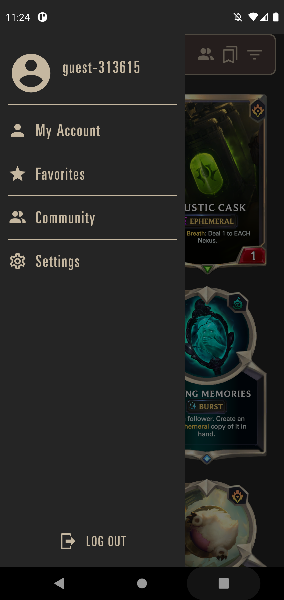
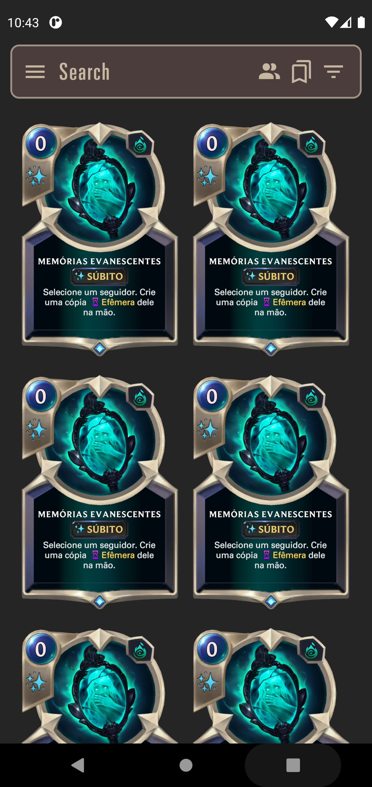
</p>

- Filtros
<p align="center">
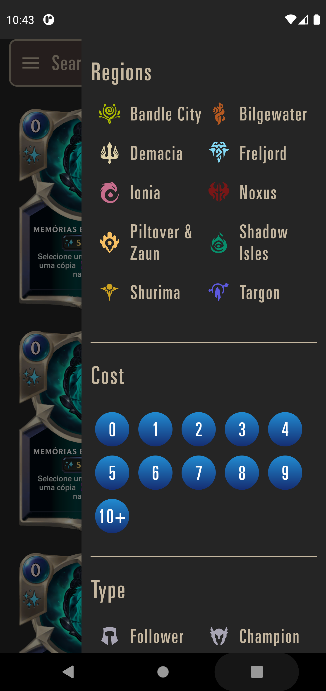
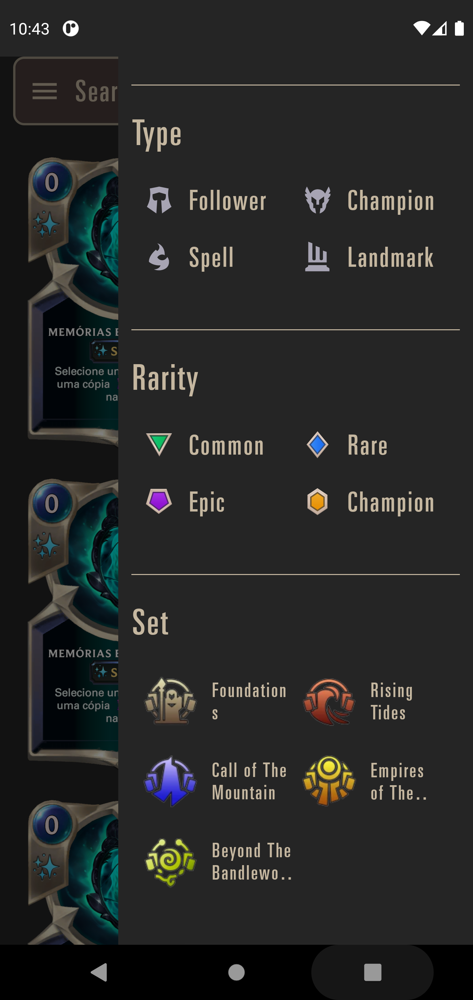
</p>

- Informações da Carta
<p align="center">
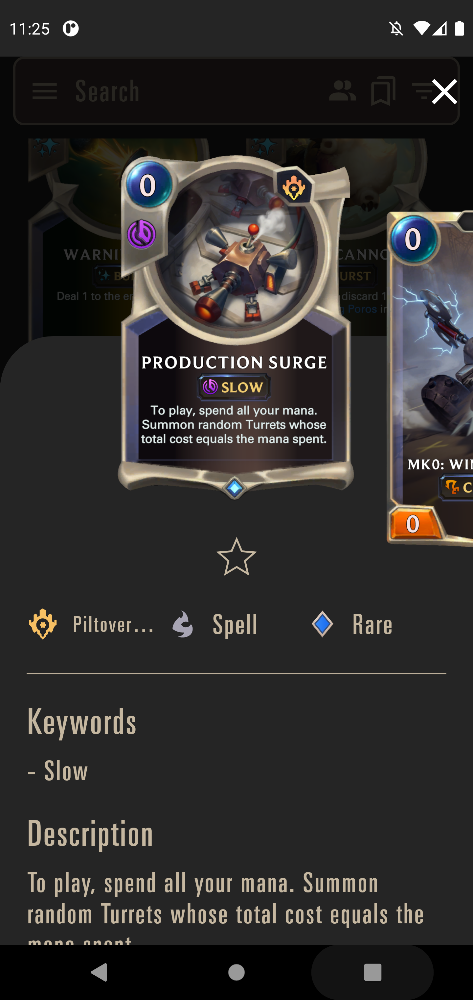
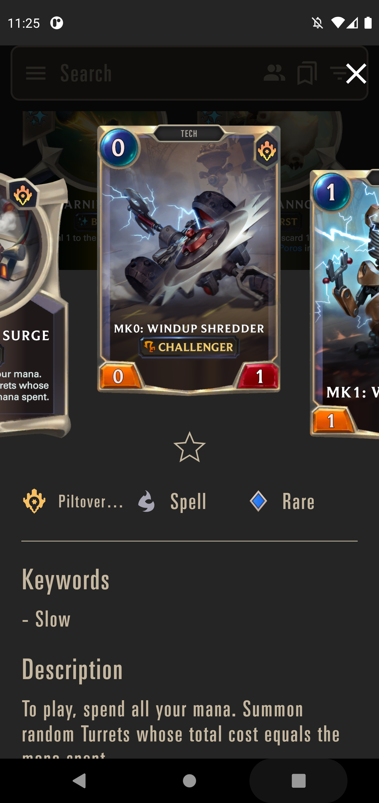
</p>

### Autenticação

### Favoritos
<p align="center">
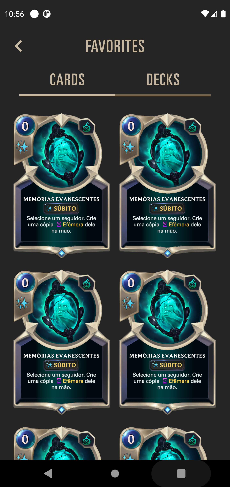
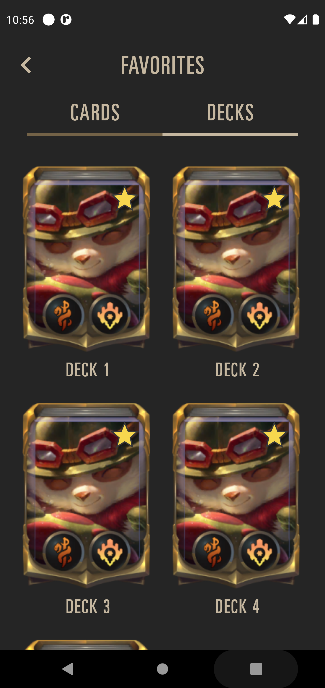
</p>

### Configurações
<p align="center">
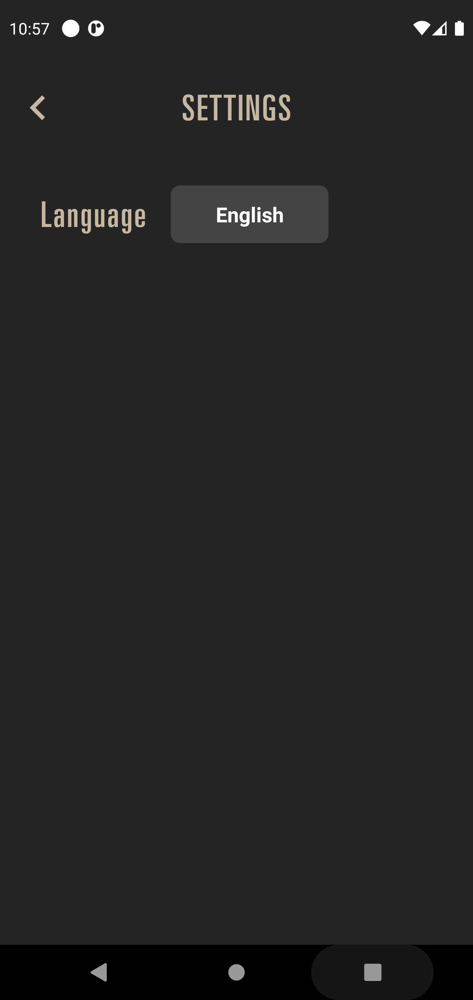
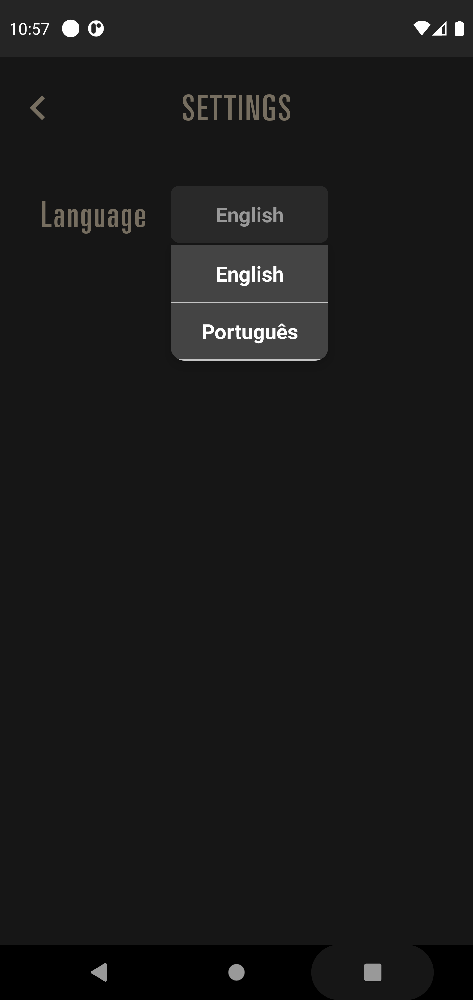
</p>

### Decks
<p align="center">
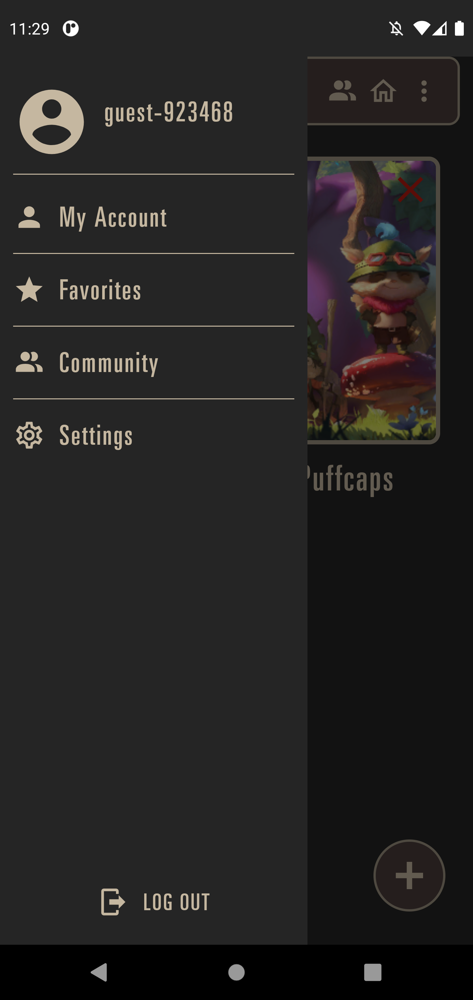

</p>

## Como Utilizar
Antes de começar a utilizar o projeto, certifique-se de que o [Yarn](https://classic.yarnpkg.com/lang/en/docs/install) está devidamente instalado na máquina. 

Em seguida, em um terminal clone o repositório no local desejado com:
```
git clone https://github.com/leoruas/deck-chips-frontend
```

Com o repositório clonado. Abra um emulador ou concte um celular via cabo usb à máquina e, em um terminal na root do projeto, instale as dependências com o comando:
```
yarn install
```

Feito isso, ainda na root do projeto utilize o comando:
```
yarn android
```
Caso esteja utilizando um dispositivo IOS troque 'android' por 'ios'

Esse comando irá buildar o aplicativo e abri-lo automaticamente no dispositivo.