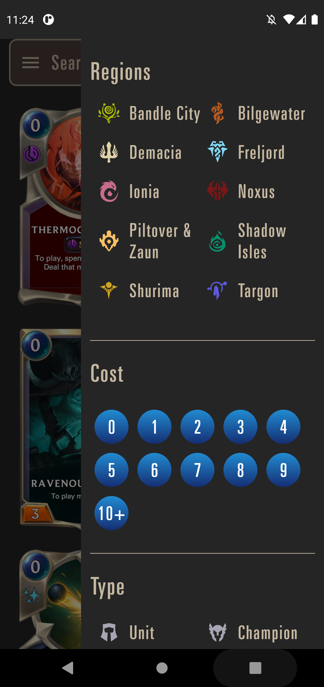
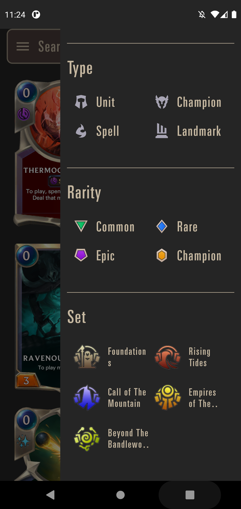
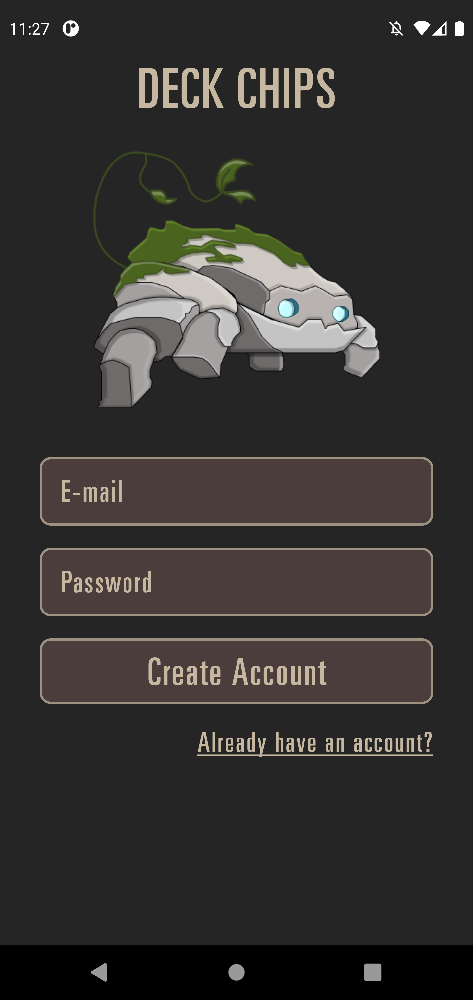
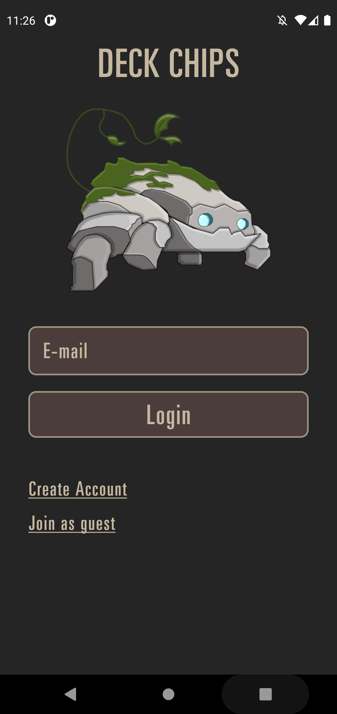
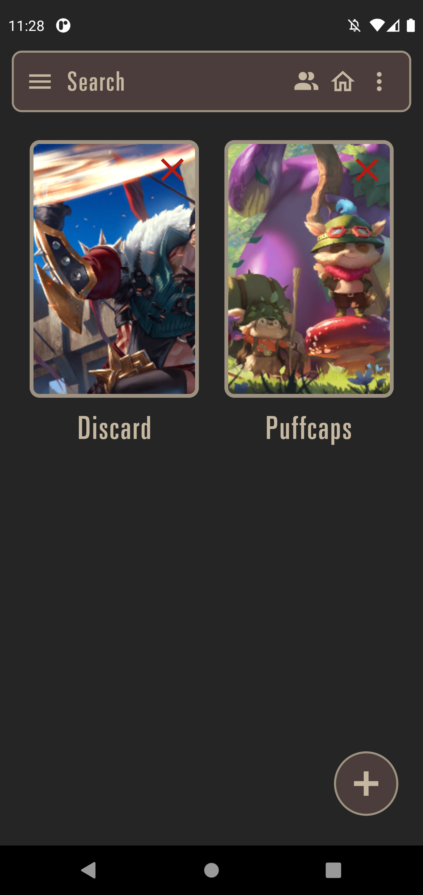

## Deck Chips

Aplicativo para a dsiciplina de mobile

Deck Chips Server: https://github.com/octaviomuller/deck-chips-server

## Integrantes

- Augusto Hideki Shimizu - RA: 171026

  - CP110TIN2

- Juliana Cristina Ferreira Izac - RA: 190778

  - CP110TIN2
  - PA038TIN3

- Leonardo Coelho Ruas - RA: 190089

  - CP110TIN2
  - PA038TIN3

- Octávio Henrique Müller Barrio - RA: 190067
  - CP110TIN2
  - PA038TIN3

## Principais Funcionalidades

- Listagem de cartas com filtros
- Informações de uma carta e cartas relacionadas
- Criação e edição de decks
- Informações de decks
- Importação e exportação de decks
- Compartilhamento de decks em comunidade

## Telas no App

### Home

- Tela inicial
<p align="center">


</p>

- Filtros
<p align="center">


</p>

- Informações da Carta
<p align="center">


</p>

### Autenticação

<p align="center">



</p>

### Decks

- Meus decks
<p align="center">


</p>

- Criação de decks
<p align="center">


</p>

- Informaçoes de deck
<p align="center">


</p>

### Comunidade

<p align="center">

</p>

## Como Utilizar

Antes de começar a utilizar o projeto, certifique-se de que os seguintes estejam devidamente intalados e configurados:

- [Yarn](https://classic.yarnpkg.com/lang/en/docs/install)
- [Android SDK](https://developer.android.com/studio?hl=pt&gclsrc=ds&gclsrc=ds)
- [Platform tools](https://developer.android.com/studio/command-line/adb?hl=pt-br)/Android Debug Bridge

Obs.: É suportado apenas o Android 11, para configurar no Android Studio vá em `SDK Manager > SDK Platforms > Android 11`. Também é recomendado marcar as opções `SDK Manager > SDK Platforms > Android API 33` e `SDK Manager > SDK Tools > Android SDK Build-tools 33`

Em seguida, em um terminal clone o repositório no local desejado com:

```
git clone https://github.com/leoruas/deck-chips-frontend
```

Com o repositório clonado. Abra um emulador ou concte um celular via cabo usb à máquina e, em um terminal na root do projeto, instale as dependências com o comando:

```
yarn install
```

Feito isso, ainda na root do projeto utilize o comando:

```
yarn android
```

Caso esteja utilizando um dispositivo IOS troque 'android' por 'ios'

Esse comando irá buildar o aplicativo e abri-lo automaticamente no dispositivo.
